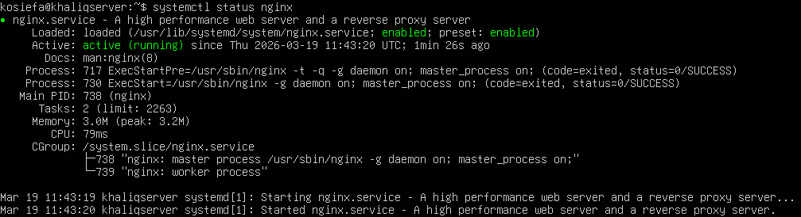
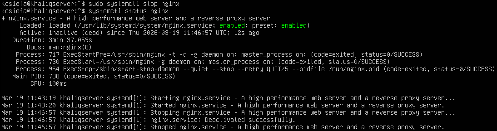
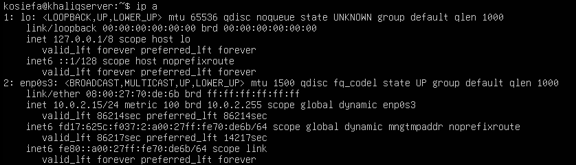
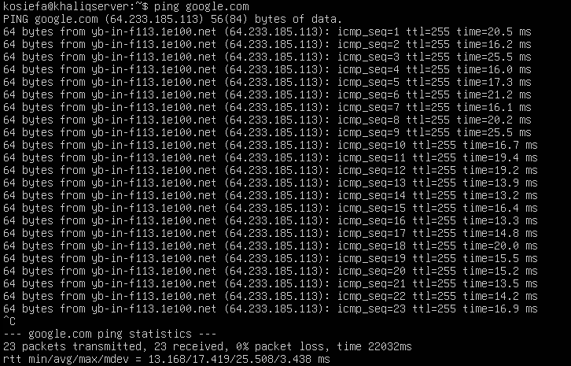

# Linux Server Setup & Troubleshooting Lab

## 📌 Overview
In this project, I set up a Linux server using Ubuntu in a virtual environment and practiced system administration and troubleshooting tasks. The goal was to gain hands-on experience with server management and basic networking concepts.

---

## 🛠️ Technologies Used
- Ubuntu Server  
- Nginx  
- VirtualBox  

---

## ⚙️ What I Did
- Installed and configured an Ubuntu Server virtual machine  
- Deployed a web server using nginx  
- Verified service status using `systemctl`  
- Tested connectivity using `ping`  
- Checked open ports using `ss`  
- Reviewed system logs using `journalctl`  

---

## 🔧 Troubleshooting Scenarios
- Simulated a service failure by stopping nginx  
- Diagnosed the issue using systemctl and logs  
- Restarted the service to restore functionality  
- Verified system and network status after resolution  

---

## 🧠 Key Skills Demonstrated
- Linux system administration  
- Service management (start/stop/restart)  
- Basic networking (IP addressing, DNS, connectivity)  
- Troubleshooting methodology  

---

## 📸 Screenshots

### Nginx Running

### Nginx Stopped

### IP Address Output

### Ping Test

---

## 🚀 What I Learned
This project helped me understand how to deploy and manage services on a Linux server, as well as how to troubleshoot common system and network issues using command-line tools.

---

## 💡 Future Improvements
- Configure firewall rules  
- Set up and test SSH remote access  
- Simulate more advanced network failures  
- Add monitoring tools  

---

## 👨‍💻 Author
Khaliq Osiefa
